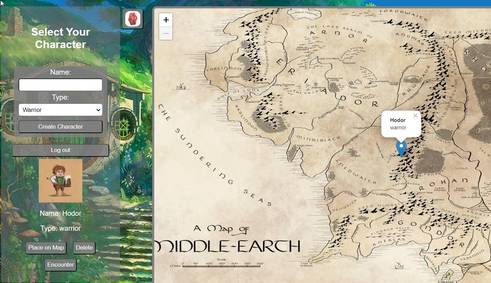

# Hobbits on Holiday
## Description
After the arduous adventures on the road, it's time for our Hobbits to kick back and definitely not run into any trouble.  Users will log in or sign up if they haven't already created a user at [Hobbits on Holidy](https://hobbits-on-holiday-xgca.onrender.com/).  This creates a session and allows users to create a new Hobbit character.  Users can place their new character on the Map of Middle Earth.  Then users will click on an encounter button to fight a baddie.  These baddies are non-canonical characters that pull from the [D&D Api](https://5e-bits.github.io/docs/api).
## Table of Contents

- [Hobbits on Holiday](#hobbits-on-holiday)
  - [Description](#description)
  - [Table of Contents](#table-of-contents)
  - [Installation](#installation)
  - [Usage](#usage)
  - [Credits](#credits)
  - [License](#license)
  - [MIT License](#mit-license)
## Installation
No Installation is required for this application.
## Usage
* Log In or Sign Up [Hobbits on Holidy] (https://hobbits-on-holiday-xgca.onrender.com/)
* Create a new Hobbit character
* Place your character on the Map of Middle Earth
* Click Encounter button to fight a baddie
* Fight!
* WIN!

## Credits
Created by:
* [Josiah Rowland](https://github.com/jocephuss)
* [Ash Corse](https://github.com/AshLCorse)
* [Chris Baumgart](https://github.com/cbaumgart004)

Resources:
* Repo for [Hobbits onHoliday](https://github/cbaumgart)
* [D&D Api](https://5e-bits.github.io/docs/api)
* [Leaflet.js](https://leafletjs.com/reference.html)
* Deployed on Render and can be found [here](https://hobbits-on-holiday-xgca.onrender.com/)
## License
[MIT License](https://github.com/jocephuss/Hobbits-On-Holiday/blob/main/LICENSE)
---
